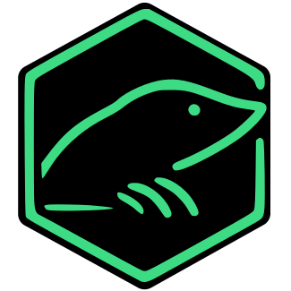
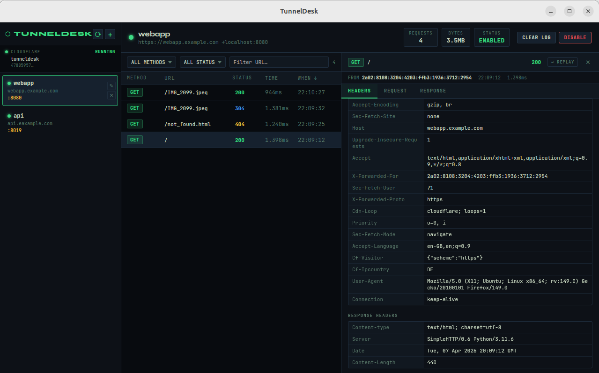

<div align="center">
  
</div>

# TunnelDesk

A local HTTP proxy for Cloudflare Tunnels with request inspection and WebSocket support.



## Features

- **Native GUI Window**: Opens a native webview window on startup — no browser required
- **CLI mode**: Optionally run without the GUI window and view requests and responses on stdout or access the UI via browser
- **Multiple Tunnels**: Manage multiple tunnels, each with their own subdomain.
- **HTTP & WebSocket Support**: Forward both HTTP requests and WebSocket connections
- **Request Inspection**: Captures all request/response headers and bodies in memory
- **Cloudflare Integration**: Automatically creates and syncs tunnel configuration, and sets up cache bypass
- **Configuration File**: TOML-based configuration which stays in sync with the Cloudflare Tunnel configuration
- **MCP Support**: Run as an MCP server on stdio

## Installation

### Prerequisites

[cloudflared](https://github.com/cloudflare/cloudflared) needs to be installed and available in your PATH already, but doesn't need to be linked to your account yet.

### Pre-built binaries

For MacOS and Windows, pre-built binaries are available from the [releases](https://github.com/heiko-r/tunneldesk/releases).

### Linux dependencies (for the native GUI window)

```bash
sudo apt-get install libwebkit2gtk-4.1-dev libsoup-3.0-dev libjavascriptcoregtk-4.1-dev libgtk-3-dev
```

### Build

```bash
# Build frontend
cd frontend && npm run build && cd ..

# Build with native GUI (default)
cargo build --release

# Build headless only (no system webview required), and without MCP support
cargo build --release --no-default-features
```

## Configuration

Create a `config.toml` file. An example showing the default values plus two tunnels is shown below.

Pass the path to the `config.toml` via the `--config` flag when running the application, or place it in these default locations:

- Linux: `~/.config/TunnelDesk/config.toml`
- macOS: `~/Library/Application Support/TunnelDesk/config.toml`
- Windows: `%APPDATA%\TunnelDesk\config.toml`

To use TunnelDesk to manage your tunnels on the Cloudflare side too, you need to, as a minimum, provide the Cloudflare API token, account ID, zone ID, and tunnel name. The first three, you can get from the Cloudflare Dashboard. The tunnel name can be any string to use as the tunnel identifier in Cloudflare. If `cloudflared` is already set up and linked to your account, you can provide the tunnel ID and token directly in the configuration file.

Tunnels can be created later via the GUI.

```toml
[logging]
stdout_level = "basic"

[capture]
max_stored_requests = 1000
max_request_body_size = 10485760

[gui]
port = 3013

[cloudflare]
api_token = "your-api-token-here"
account_id = "your-account-id"
zone_id = "your-zone-id"
tunnel_name = "your-tunnel-name"
# tunnel_id and tunnel_token are populated automatically on first run

[[tunnels]]
name = "webapp"
domain = "webapp.example.com"
socket_path = "/tmp/webapp.sock"
target_port = 8080

[[tunnels]]
name = "api"
domain = "api.example.com"
socket_path = "/tmp/api.sock"
target_port = 3000
```

## Usage

```bash
# Start with native GUI window (default)
./tunneldesk

# Start in headless server mode
./tunneldesk --no-gui

# Use a custom config file
./tunneldesk --config /path/to/config.toml
```

When launched in GUI mode, TunnelDesk opens a native window showing the web UI. Closing the window shuts down the application. In headless mode the UI is accessible at `http://127.0.0.1:3013` (or the port set in `config.toml`).

On Linux and MacOS, the application will request root access to install the `cloudflared` service. On Windows, the application needs to be run as administrator.

### MCP Usage

Example `mcp_config.json` for VS-code like IDEs:

```json
{
  "mcpServers": {
    "tunneldesk": {
      "command": "/path/to/tunneldesk",
      "args": [
        "--mcp",
        "--config",
        "/path/to/config.toml"
      ]
    }
  }
}
```

Add to Claude Code:

```bash
claude mcp add --transport stdio tunneldesk -- /path/to/tunneldesk --mcp --config /path/to/config.toml
```

## Development

```bash
# Run proxy (with GUI)
cargo run

# Run proxy (headless)
cargo run -- --no-gui

# Run as MCP server
cargo run -- --mcp

# Run tests
cargo test

# Frontend dev server (hot reload, proxies to backend on port 3013)
source ~/.nvm/nvm.sh && nvm use 24
cd frontend && npm run dev

# Build frontend for production
cd frontend && npm run build
```

## License

MIT
