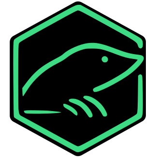
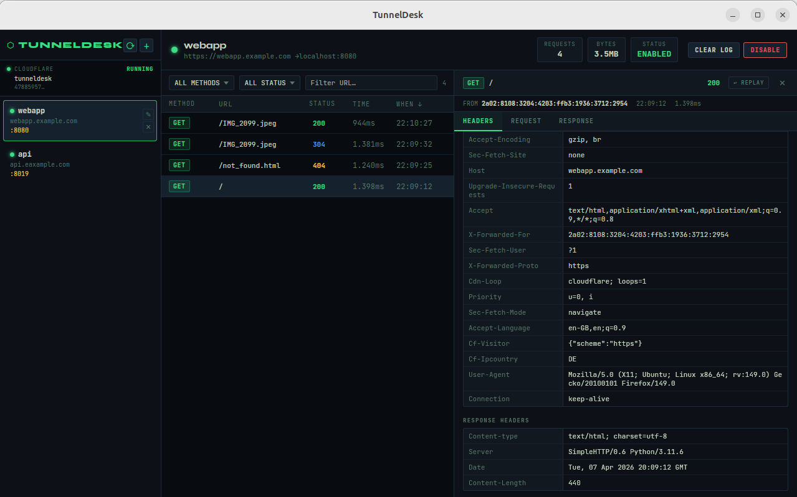

<div align="center">
  
</div>

# TunnelDesk

A local HTTP proxy for Cloudflare Tunnels with request inspection and WebSocket support.



## Features

- **Native GUI Window**: Opens a native webview window on startup — no browser required
- **CLI mode**: Optionally run without the GUI window and view requests and responses on stdout or access the UI via browser
- **Multiple Tunnels**: Manage multiple tunnels, each with their own subdomain.
- **HTTP & WebSocket Support**: Forward both HTTP requests and WebSocket connections
- **Request Inspection**: Captures all request/response headers and bodies in memory
- **Cloudflare Integration**: Automatically creates and syncs tunnel configuration, and sets up cache bypass
- **Configuration File**: TOML-based configuration which stays in sync with the Cloudflare Tunnel configuration
- **Shared Core**: The native window, browser tabs and MCP clients for the same config file all share one set of tunnels and captured requests; separate config files run fully independently
- **MCP Support**: Run as an MCP server on stdio, or connect over Streamable HTTP

## Installation

### Prerequisites

[cloudflared](https://github.com/cloudflare/cloudflared) needs to be installed and available in your PATH already, but doesn't need to be linked to your account yet. TunnelDesk runs it as a child process, so no root or administrator rights are needed.

### Pre-built binaries

For Ubuntu, MacOS and Windows, pre-built binaries are available from the [releases](https://github.com/heiko-r/tunneldesk/releases).

### Linux dependencies (for the native GUI window)

```bash
sudo apt-get install libwebkit2gtk-4.1-dev libsoup-3.0-dev libjavascriptcoregtk-4.1-dev libgtk-3-dev
```

### Build

```bash
# Build frontend
cd frontend && npm run build && cd ..

# Build with native GUI (default)
cargo build --release

# Build headless only (no system webview required), and without MCP support
cargo build --release --no-default-features
```

## Configuration

Create a `config.toml` file. An example showing the default values plus two tunnels is shown below.

Pass the path to the `config.toml` via the `--config` flag when running the application, or place it in these default locations:

- Linux: `~/.config/TunnelDesk/config.toml`
- macOS: `~/Library/Application Support/TunnelDesk/config.toml`
- Windows: `%APPDATA%\TunnelDesk\config.toml`

To use TunnelDesk to manage your tunnels on the Cloudflare side too, you need to, as a minimum, provide the Cloudflare API token, account ID, zone ID, and tunnel name. The first three, you can get from the Cloudflare Dashboard.

The token needs permission to:
- Edit DNS
- Edit cache settings
- Edit Cloudflare One Connector: cloudflared

The tunnel name can be any string to use as the tunnel identifier in Cloudflare. If `cloudflared` is already set up and linked to your account, you can provide the tunnel ID and token directly in the configuration file.

Tunnels can be created later via the GUI.

```toml
[logging]
stdout_level = "basic"

[capture]
max_stored_requests = 1000
max_request_body_size = 10485760

[gui]
# Port of the web UI, WebSocket and MCP endpoint (always bound to 127.0.0.1).
# 0 picks a free port on every start; frontends find it automatically.
port = 3013
# access_token is generated on first start; see "Security" below
# Extra origins allowed to connect, e.g. the vite dev server:
# allowed_origins = ["http://localhost:5173"]

[core]
# Seconds without any attached window, browser tab or MCP client before a
# background core shuts down (not used by `tunneldesk serve`)
idle_timeout_secs = 30

[cloudflare]
api_token = "your-api-token-here"
account_id = "your-account-id"
zone_id = "your-zone-id"
tunnel_name = "your-tunnel-name"
# tunnel_id and tunnel_token are populated automatically on first run
# Set to false if you run cloudflared yourself (e.g. as a system service)
# manage_cloudflared = true

[[tunnels]]
name = "webapp"
domain = "webapp.example.com"
socket_path = "/tmp/webapp.sock"
target_port = 8080

[[tunnels]]
name = "api"
domain = "api.example.com"
socket_path = "/tmp/api.sock"
target_port = 3000
```

## Usage

```bash
# Open the native GUI window (default)
./tunneldesk

# Open the web UI in your browser instead
./tunneldesk open

# Run in the foreground without a window, until Ctrl+C
./tunneldesk serve

# Stop the tunnels for a config file (all windows and MCP clients disconnect)
./tunneldesk stop

# List all running TunnelDesk cores
./tunneldesk status

# Run as an MCP server on stdio (starts the core if needed)
./tunneldesk mcp

# Print MCP client configuration for this config file
./tunneldesk mcp-config

# Every command accepts a custom config file
./tunneldesk --config /path/to/config.toml open
```

### How it runs

For each config file, TunnelDesk runs one background **core** process. The core owns the `cloudflared` connector, the socket-to-port proxies and the captured requests, and serves the web UI, WebSocket API and MCP endpoint on `127.0.0.1`. The native window, browser tabs and MCP clients are thin frontends: they find the core for their config file, or start it if none is running.

- Opening a second window or adding an MCP client for the **same** config file attaches to the running core. All of them see the same tunnels and requests, and changes made in one appear in all others.
- A **different** config file gets its own core, with its own port, `cloudflared` connector and tunnels.
- Closing the last window or MCP client does not stop the tunnels immediately. The core exits after `idle_timeout_secs` without any attached frontend and removes the routes from Cloudflare. To stop right away, use the ⏻ button in the sidebar or `tunneldesk stop`.
- `tunneldesk serve` runs the core in the foreground and keeps running until it is interrupted or stopped.

Running cores publish their port in a small info file in the user's runtime directory (`$XDG_RUNTIME_DIR/tunneldesk` on Linux, `~/Library/Application Support/TunnelDesk/run` on macOS, `%LOCALAPPDATA%\TunnelDesk\run` on Windows). A background core writes its log next to it. Set `TUNNELDESK_RUNTIME_DIR` to use a different directory.

### Security

The core only listens on `127.0.0.1` and requires an access token, which is generated into `[gui] access_token` on first start. The config file is written with owner-only permissions on Linux and macOS.

- The native window and `tunneldesk open` log in automatically. Opening `http://127.0.0.1:<port>/` manually shows a login hint; run `tunneldesk open` instead.
- API clients send the token as `Authorization: Bearer <token>`.
- Requests with a foreign `Host` header (DNS rebinding) or a foreign `Origin` (other websites) are rejected. Add trusted origins to `[gui] allowed_origins`.

### Migrating from the cloudflared system service

Earlier versions installed `cloudflared` as a system service, which needed root or administrator rights. TunnelDesk now starts `cloudflared` itself and stops it on exit. To remove the old service, run `sudo cloudflared service uninstall` (or `cloudflared service uninstall` as administrator on Windows). To keep running it yourself instead, set `manage_cloudflared = false` in `[cloudflare]`.

### MCP Usage

The easiest setup runs TunnelDesk as a stdio MCP server. It starts the core in the background if needed, and shares it with the GUI and any other MCP clients using the same config file. `tunneldesk mcp-config` prints ready-made snippets with the correct paths.

Example `mcp_config.json` for VS-code like IDEs:

```json
{
  "mcpServers": {
    "tunneldesk": {
      "command": "/path/to/tunneldesk",
      "args": [
        "mcp",
        "--config",
        "/path/to/config.toml"
      ]
    }
  }
}
```

Add to Claude Code:

```bash
claude mcp add --transport stdio tunneldesk -- /path/to/tunneldesk mcp --config /path/to/config.toml
```

Clients that support Streamable HTTP can also connect to a running core directly at `http://127.0.0.1:<port>/mcp`, with the access token as a bearer token. This needs a fixed `[gui] port`, and the core must already be running (e.g. via `tunneldesk serve`):

```json
{
  "mcpServers": {
    "tunneldesk": {
      "url": "http://127.0.0.1:3013/mcp",
      "headers": { "Authorization": "Bearer <gui.access_token from config.toml>" }
    }
  }
}
```

## Development

```bash
# Run proxy (with GUI)
cargo run

# Run proxy (headless)
cargo run -- serve

# Run as MCP server
cargo run -- mcp

# Run tests
cargo test

# Build frontend for production
cd frontend && npm run build
```

### Frontend dev server

The vite dev server (hot reload) connects to a separately running core, e.g. `cargo run -- serve` with a fixed `[gui] port`. Because it runs on another origin, the core has to allow it and the dev server needs the token:

1. In the config, set `allowed_origins = ["http://localhost:5173"]` under `[gui]`.
2. Create `frontend/.env.development.local` (gitignored) with the core's port and token:

   ```bash
   VITE_BACKEND_PORT=3013
   VITE_BACKEND_TOKEN=<gui.access_token from config.toml>
   ```

3. Start the dev server:

   ```bash
   source ~/.nvm/nvm.sh && nvm use 24
   cd frontend && npm run dev
   ```

## License

MIT
